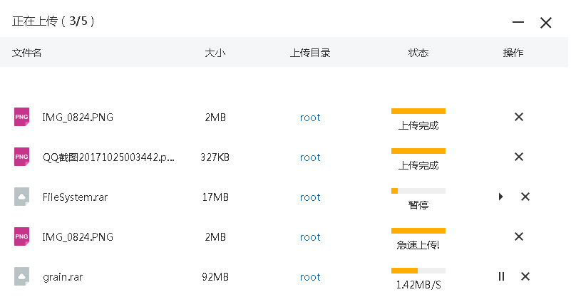

# anyupload

[](https://travis-ci.org/dianbaer/anyupload)
[](https://www.codacy.com/app/232365732/anyupload?utm_source=github.com&amp;utm_medium=referral&amp;utm_content=dianbaer/anyupload&amp;utm_campaign=Badge_Grade)
[](LICENSE)


### anyupload是一个极度纯净的上传插件，通过简单调整就可以融入到任何项目，支持多文件上传、上传速率动态控制、真实进度监控kb/s、分块生成MD5、分块上传、MD5校验秒传、暂停、取消等。



## 项目目录结构：

	
### AnyUploadClient

	|--js（js库）
		|--anyupload（anyupload文件夹）
			|--css（anyupload css）
			|--dist（anyupload js打包版本）
			|--images（anyupload image）
			|--src（anyupload js未打包版本）
		|--lib（依赖js）
			|--jquery.min.js
			|--juggle-all.js（解耦合的工具库：https://github.com/dianbaer/juggle）
			|--spark-md5.js（用于分块计算md5）
	|--index.html（示例启动项目）


### AnyUploadServer

	|--src（服务器代码）
	|--protobuf（消息包生成工具）


### AnyUploadClient怎么使用：

```html

<!DOCTYPE html>
<html>
<head>
    <meta charset="UTF-8">
    <title></title>
    <!--juggle库-->
    <script src="js/lib/juggle-all.js" type="text/javascript"></script>
    <!--分块生成md5-->
    <script src="js/lib/spark-md5.js" type="text/javascript"></script>
    <script src="js/lib/jquery.min.js" type="text/javascript"></script>
    <link href='js/anyupload/css/anyupload.css' rel='stylesheet' type='text/css'/>
    <!--anyupload库-->
    <script src="js/anyupload/dist/anyupload.js" type="text/javascript"></script>

</head>
<script type="text/javascript">
    var fileMediator;
    /**
     * 选择文件时的响应
     * @param e
     */
    var uploadFileButtonChange = function (e) {
        if (!("FileReader" in window) || !("File" in window)) {
            alert("您的浏览器不支持html5，请使用google，firefox，ie10等浏览器");
            return;
        }
        var files = e.target.files;
        //调用anyupload上传函数
        fileMediator.upLoadFile(files);
        //清空上传按钮的内容
        $("#uploadFileButton").val("");
    };
    window.onload = function () {
        /****初始化anyupload开始*****/
        fileMediator = new anyupload.FileMediator();
        //设置anyupload的容器对象
        fileMediator.initView($("#anyUploadContainer"));
        //设置anyupload的上传地址
        anyupload.uploadFileProxy.url = "http://localhost:8080/AnyUploadServer/s";
        /****初始化anyupload结束*****/
        $("#uploadFileButton").on("change", uploadFileButtonChange);

    }
</script>
<body>
<!--上传按钮-->
<input type="file" class="myFile_PJY" multiple="multiple" id="uploadFileButton"/>
<!--anyupload容器div-->
<div id="anyUploadContainer" style="width: 800px;margin-top: 50px;"></div>
</body>
</html>


```


### AnyUploadServer怎么使用

	服务器需要将代码融入到项目中，按照AnyUploadServer代码示例需要提供两个接口
	
	message MD5CheckC{
		string hOpCode=1;
		string fileBaseMd5=2;//md5
		string userFileName=3;//文件名
		string userFoldParentId=4;//父类文件夹id
		int64 fileBaseTotalSize=5;//文件总大小
		string userFileId=6;//文件id
	}
	message MD5CheckS{
		string hOpCode=1;
		int32 result=2;//结果1：秒传，2：可以上传
		int64 fileBasePos=3;//开始位置
		int32 uploadMaxLength=4;//一次上传最大长度
		string userFileId=5;//文件id
	}
	message UploadFileC{
		string hOpCode=1;
		string userFileId=2;//文件id
		int64 fileBasePos=3;//开始位置
		int32 uploadLength=4;//上传的长度
	}
	message UploadFileS{
		string hOpCode=1;
		int32 result=2;//结果1：秒传，2：可以上传，3上传完成
		int64 fileBasePos=3;//开始位置
		int32 uploadMaxLength=4;//一次上传最大长度
		string userFileId=5;//文件id
		int32 waitTime=6;//等待时间
	}
	
### 基于grain与juggle：

https://github.com/dianbaer/grain

https://github.com/dianbaer/juggle
